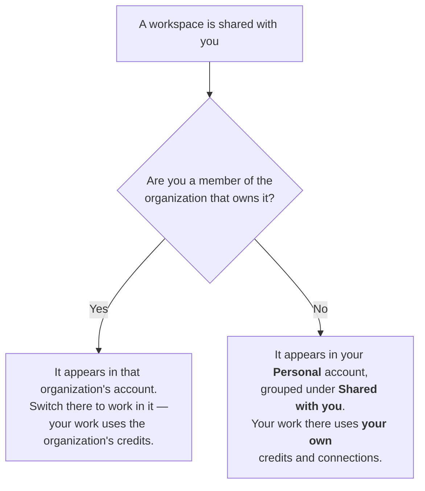

An organization is a company directory and account context in Script.it. It brings together members, organization-shared workspaces, billing, and usage controls.

You always have a **Personal** account, and you can create or join more than one organization. You use one active account at a time.

## Personal and organization accounts

| Account | Best for | Included access |
|---|---|---|
| Personal | Your own work | Your private workspace, workspaces shared with you from outside your organizations, and your personal credits |
| Organization | Company work | The organization's workspaces (shared org-wide or with you directly), workspace integrations, and the organization's credits and limits |

Switching accounts changes which workspaces and integrations are available and which account pays for new usage. It does not move or delete scripts, sessions, or connections.

Every shared workspace appears in exactly one of your accounts, decided by membership in the organization that owns it:

The account switcher lists only organizations you are a member of. Being invited to a single workspace never adds an organization to your switcher — see [Working in a workspace shared from outside](#working-in-a-workspace-shared-from-outside) below.

<Note>
  Creating an organization does not automatically share a workspace with it. Create workspaces privately, then explicitly add people or an organization from the workspace's access settings.
</Note>

## Working in a workspace shared from outside

When someone shares a workspace with you and you are **not** a member of the organization that owns it, the workspace shows up in your **Personal** account under **Shared with you**, labeled with the owner's name.

- You collaborate on the same scripts and files as everyone else in the workspace.
- Everything you run there uses **your own credits**, and integrations resolve to **your own connections** — never the owner's.
- If the workspace is owned by an organization, connections its members share into it are available to those members only; you connect your own tools instead. If it is owned by a person's Personal account, connections shared into it work for every invited collaborator.
- If you later join the owning organization, the workspace moves out of **Shared with you** and becomes available through that organization's account instead. Any triggers you created on it start running under the organization from then on — the invitation screen shows this before you accept.

## Switch your active account

Use the account switcher in the sidebar or the Settings header:

1. Open the account switcher.
2. Choose **Personal** or an organization.
3. Wait for Script.it to synchronize your workspace access.

Script.it opens a new session after the switch and updates your workspace access.

## Create and manage an organization

Open **Settings → Organization** to create an organization or manage one you belong to. From an organization's menu, permitted roles can rename it, set an image, invite members, or delete it.

New organizations do not receive Personal free credits. To run billable actions, an organization must choose a credit plan. You can switch back to Personal at any time.

An owner can delete an organization only after its paid subscription has ended. Deleting it removes organization membership and inherited workspace access; it does not delete a workspace that still has another Editor.

## Roles and permissions

| Role | Organization settings | Members and auto-join | Organization usage | Billing |
|---|---|---|---|---|
| Owner | Manage | Manage | View and set member caps | Manage |
| Admin | Manage | Manage | View and set member caps | No access |
| Billing admin | View | View | Own usage only | Manage |
| Member | View | View | Own usage only | No access |

Owners can invite members, admins, and billing admins. Admins can invite members. An admin cannot change or remove an owner or another admin, and an organization must always retain an owner.

## Invite members

Owners and admins can invite people from **Settings → Organization**:

1. Open the organization's **···** menu and select **Invite members**, or use the invite form for the active organization.
2. Enter an email address and choose an allowed role.
3. Send the invitation.

The recipient can accept or decline the invitation in Script.it. Accepting adds them to the directory but does not switch their active account.

## Configure auto-join domains

Auto-join domains let people with a verified work email join an organization automatically after they sign in.

1. Open **Settings → Organization** and select the organization.
2. Under **Auto-join domains**, enter the company's domain.
3. Add the displayed DNS TXT record at your domain provider.
4. Return to Script.it and verify the domain.

After verification, matching users join as members and can access workspaces shared with the organization. An organization can verify multiple domains, but a domain can belong to only one active organization.

## Share a workspace with an organization

Workspace Editors can manage access, but only an organization owner or admin can add or remove that entire organization.

1. Open **Settings → Sharing → Workspaces**.
2. Select **Members** for the workspace.
3. Search for a person or organization.
4. Choose **Can edit** or **Can view**, then send the invitation or add the organization.

All current and future organization members inherit the organization's workspace role. Direct grants to individual people remain separate, and the strongest applicable role wins.

Connections are shared with workspaces, not directly with organizations. Connections shared into an organization-owned workspace are usable by the organization's members while that organization is active; a collaborator from outside the organization sees the workspace but uses their own connections.

See [Workspaces](/account/workspace) and [Billing](/account/billing) for details.
