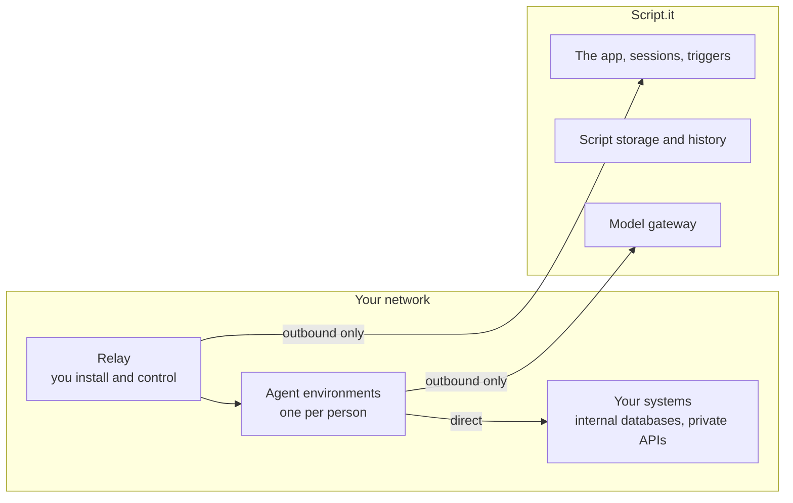

Some of the automations you want to build need to reach systems that were never meant to be public — an internal Postgres, a service inside your VPC, an API with no route from outside. By default, Script.it agents run on our infrastructure, so those systems are out of reach.

With a **relay**, they aren't. You install one service on a machine you own, and your team's agents run there instead.

## How it works

You run one Linux machine inside your own network and install the relay on it. The relay opens a single connection **outward** to Script.it and keeps it open. Script.it uses that connection to run your team's environments on your machine.

Nothing needs to point inward. You add no firewall rules, no public IP, and no VPN peering.



Because the agent is already inside your perimeter, private endpoints work with no allowlists and no tunnel to maintain. Internal hostnames resolve the way they do anywhere else on that machine.

## What runs where

This is worth being precise about, because it's usually the deciding factor.

**Stays in your network**

- The agent process itself — every command it runs and every file it touches.
- Your credentials. Environment variables are read from your machine. We never receive or store them.
- Any request a script makes directly. It goes straight from your machine to the destination.
- Compute. You choose the instance size and pay for it directly.

**Still reaches Script.it**

- Your automation code. Scripts are stored and versioned by us, which is what lets your team share and collaborate on them.
- Session history and agent state, so a rebuilt environment restores cleanly. This can be turned off if you'd rather it stayed on your machine.
- Connected integrations. See below.
- Prompts and model traffic. Whatever an agent reads from your systems and then reasons about passes through our gateway on its way to the model provider.

<Note>
  A relay changes **where your agents run**, not where your data is processed. If your requirement is that no data may be processed by a third party at all, see [When you need full on-premise](#when-you-need-full-on-premise) below.
</Note>

## Connecting to internal systems

Scripts reach your internal systems by connecting to them directly, using credentials you provide on your own machine.

You put the values in a file on the relay host, or point the relay at your own secrets manager:

```yaml /etc/scriptit-relay/config.yaml
sandbox_env:
  file: /etc/scriptit-relay/sandbox.env
  # or resolve from your own secret store:
  # aws_secrets_manager: arn:aws:secretsmanager:us-east-1:...:secret:scriptit/sandbox
```

Every environment on that relay then receives those variables, and a script reads them the usual way:

```python
import os, psycopg2

conn = psycopg2.connect(os.environ["INTERNAL_DB_URL"])
```

Values are read when an environment starts, so changing them takes effect after you apply the change from **Settings → Compute**.

<Warning>
  Anything you inject is readable by the agent working in that environment, and agents send what they read to the model provider in order to reason about it. Give the relay credentials scoped to what your automations actually need — a read-only role against the specific database, rather than broad access.
</Warning>

## Connected integrations

Integrations you connect through Script.it — GitHub, Slack, Salesforce, and the rest of the catalog — are called **by us**, from our infrastructure, using the credentials you connected. That doesn't change when you run a relay.

Only requests a script makes itself travel directly from your machine.

This has one practical consequence worth planning around: **an internal API can't be added as a connected integration**, because we would be the ones calling it and we can't reach your network. Reach internal services by calling them directly from your script, with credentials from the section above.

## What you need

<Steps>
  <Step title="A Linux machine in your network">
    x86-64 with Docker installed. Start around 4 vCPU and 16 GB of memory, with 100 GB of disk, plus headroom for each person working at the same time.
  </Step>
  <Step title="Outbound HTTPS">
    Port 443 to Script.it. No inbound rules, no public IP, and no changes to your security groups.
  </Step>
  <Step title="Ten minutes to install">
    Go to **Settings → Compute**, click **Add relay**, and copy the install command. It carries a single-use token that expires in an hour. The machine appears in your settings as soon as it connects.
  </Step>
</Steps>

Once it's online, you'll see which environments are running on it, how much capacity is left, and when a sandbox update is available.

## When you need full on-premise

A relay is the right fit when your problem is **reach** — the automations you want are blocked because the systems they need aren't reachable from outside, and you're comfortable with a hosted product processing your data.

Choose full on-premise instead when your problem is **residency** — policy or regulation says your data may not be processed by a third party. A relay doesn't get you there, because model traffic still carries whatever an agent reads. Full on-premise puts the entire platform, including the model gateway and your own provider keys, inside your perimeter.

If you're not sure which applies, talk to us before you start — the two paths are very different amounts of work, and it's worth getting right up front.
